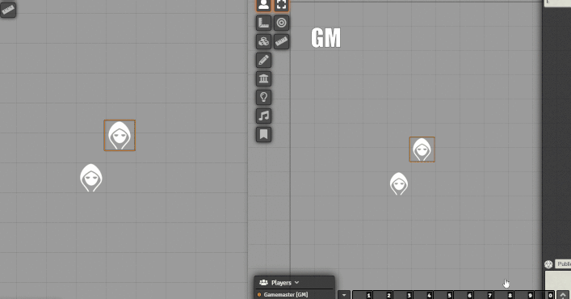

# Why?
     
Sometimes  a scene requires a little extra spice , perhaps the evil villain wants to enunciate on every step as he speaks about how he enjoyed an evil act on every ... little... step or perhaps a character rolls a nat 20 and punches a character across a room and it launches him soaring through the air across the room. This module is built to allow GMs to add that extra ***spice*** to their GM-ing 

     

# Current Features
 - Keybinding Animate Button
 - Live Animate singular character tokens

# Development Instructions From the Template:
About Bundler:  
This project uses webpack to bundle your files. What this means is that every script file in src/ will get 'bundled' into one output .js file in dist/.
Likewise every static file (.html, .json, etc.) in static/ will get moved to dist.  
Because of this you should NOT have your development working directory inside the foundryuser folder. Instead you should follow the instructions below
for setting up symantic links between the dist/ folder and foundryuser.

- Run npm install
- Rename module.ts to your chosen module name.
- Rename the references to module.ts in webpack.config.js file. (Line 26)
- Fill in module.json with actual information.
- run: npm run build  
- Create a symantic link between the dist/ folder to a module folder in FoundryUser/Data/modules/[MODULE_NAME]  
--	Instructions (for windows) 
--	Open a command prompt and navigate to FoundryUser/Data/modules   
--	Run: mklink /D MODULE_NAME [DEVELOPMENT_PATH]/dist  

A note on typescript, it is completely optional and if you do not wish to use then rename any .ts files and their references to .js.

        

# Development Commands:
Development: 
To run with hotswap enabled run the command: npm run start

Release:
To ready the project for release run the command: npm run build:production

# Credits:
inSquared for his kind patronage          
Stäbchenfisch for his exceptional support   
League of Extraordinary FoundryVTT Developers   
Used webpack and setup files as reference: https://github.com/anvil-vtt/FateX   
Used github workflow and template reference: https://github.com/League-of-Foundry-Developers/FoundryVTT-Module-Template   
